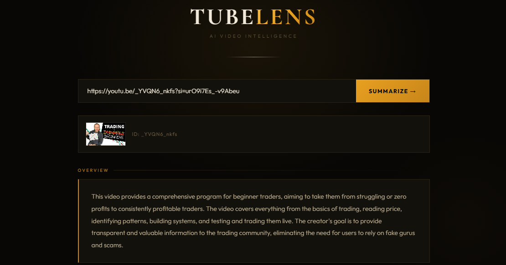
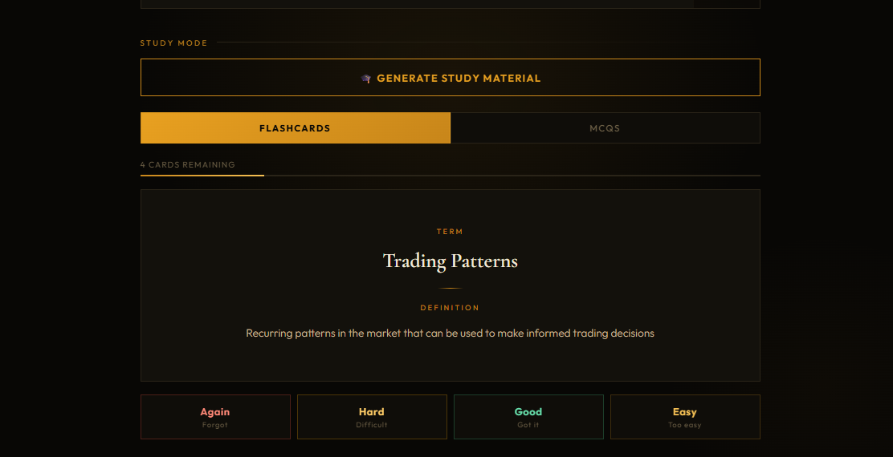
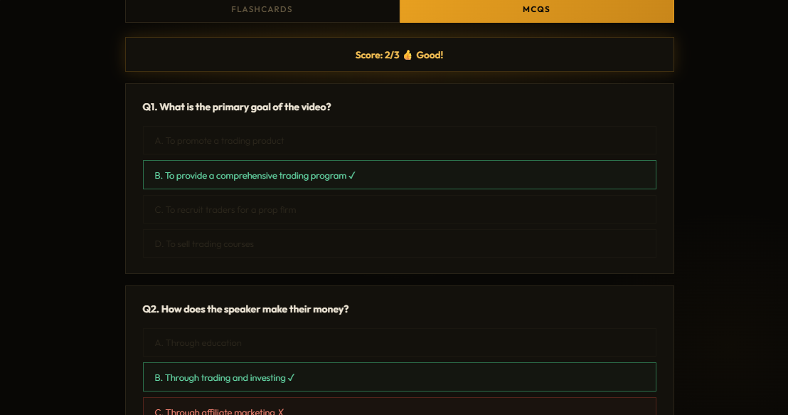

# 🎬 TubeLens — AI YouTube Video Intelligence Platform

> Summarize any YouTube video, chat with its content, and generate study material — powered by LLaMA AI.


---

## ✨ Features

### 📋 Phase 1 — Smart Summarization
- Paste any YouTube URL and get an instant AI-generated summary
- **Timestamped chapters** across the full video duration
- **Worth Watching** section — know if it's relevant before you watch
- Works for **any video** — uses YouTube captions or falls back to OpenAI Whisper for videos without captions
- Supports English, Hindi, Kannada, Telugu and more

### 💬 Phase 2 — Chat with the Video
- Ask questions about any part of the video
- AI answers using the transcript as context
- References exact timestamps in responses
- Full conversation history maintained
- Markdown-formatted responses with code blocks

### 🎓 Phase 3 — Study Mode
- **Anki-style Flashcards** with spaced repetition (Again / Hard / Good / Easy)
- **Interactive MCQs** — click to answer, instant right/wrong feedback with score
- Auto-generated from video content — perfect for lecture videos

---

## 🛠️ Tech Stack

| Layer | Technology |
|---|---|
| Frontend | React 18 + Vite |
| Backend | FastAPI (Python) |
| AI Model | LLaMA 3.3 70B via Groq API |
| Transcription | YouTube Transcript API + OpenAI Whisper |
| Audio Download | yt-dlp + FFmpeg |
| Styling | Custom CSS with Cormorant Garamond + Outfit fonts |

---

## 🚀 Getting Started

### Prerequisites
- Python 3.10+
- Node.js 18+
- FFmpeg installed
- Groq API key (free at [console.groq.com](https://console.groq.com))

### Backend Setup

```bash
cd backend
python -m venv venv
venv\Scripts\activate  # Windows
pip install -r requirements.txt
```

Create `.env` file in `backend/`:
```
GROQ_KEY_1=your_groq_key_here
GROQ_KEY_2=your_second_key_here  # optional
GROQ_KEY_3=your_third_key_here   # optional
```

Run backend:
```bash
uvicorn main:app --reload
```

### Frontend Setup

```bash
cd frontend
npm install
npm run dev
```

Open [http://localhost:5173](http://localhost:5173)

---

## 🏗️ Project Structure

```
tubelens/
├── backend/
│   ├── main.py          # FastAPI app with all endpoints
│   ├── requirements.txt
│   └── .env             # API keys (not committed)
├── frontend/
│   ├── src/
│   │   ├── App.jsx      # Main React component
│   │   └── index.css    # Premium dark gold UI
│   └── package.json
└── README.md
```

---

## 📡 API Endpoints

| Method | Endpoint | Description |
|---|---|---|
| POST | `/summarize` | Get summary + timestamped chapters |
| POST | `/chat` | Chat with video content |
| POST | `/study` | Generate flashcards + MCQs |

---

## 💡 Key Engineering Highlights

- **Chunked transcript processing** — splits long videos (54+ min) into 10-min chunks, generates chapters for each, then merges for accurate full-video timestamps
- **Automatic API key rotation** — rotates between multiple Groq keys when one hits rate limits, ensuring uptime
- **Dual transcription pipeline** — tries YouTube captions first (fast), falls back to Whisper (works for any video)
- **Anki-style spaced repetition** — flashcard session tracks Again/Hard/Good/Easy ratings, surfaces difficult cards more frequently

---

## 📸 Screenshots









---

## 🔮 Upcoming Features

- [ ] Phase 4 — Video Comparison Mode (compare 2-3 videos side by side)
- [ ] Phase 5 — Multilingual summaries (output in Kannada, Hindi, Telugu)
- [ ] Persistent Anki deck with review scheduling across sessions
- [ ] User authentication + saved video history

---

## 👩‍💻 Built By

**Vaishnavi G C** — Pre-final year CSE student at SJCIT, Bengaluru  
[GitHub](https://github.com/VaishnaviGC) · [LinkedIn](https://linkedin.com/in/vaishnavigc)

---

> *"Don't watch the whole video — just TubeLens it."*